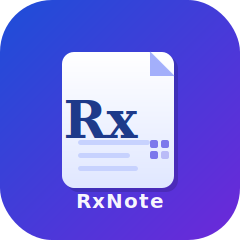

# RxNote

<p align="center">
  
</p>

A dual-platform quick note-taking app with QR code and NFC support.

## Overview

RxNote lets users create and share notes that can be accessed via QR codes or NFC chips. Notes support markdown content, images, location data, and typed actions (links, WiFi credentials). Access is controlled by visibility settings (public, auth-only, private).

- **Backend** (`/backend`) — Next.js app with REST APIs and public note preview pages
- **iOS App** (`/RxNote`) — Swift mobile app with App Clips support for QR/NFC scanning

## Quick Start

### Backend

```bash
cd backend
bun install
cp .env.example .env          # fill in credentials
bun run db:push               # push schema to database
bun run dev                   # start dev server at http://localhost:3000
```

### iOS App

1. Copy `RxNote/RxNote/Config/Secrets.xcconfig.example` to `Secrets.xcconfig` and add your OAuth client IDs.
2. Open `RxNote/RxNote.xcodeproj` in Xcode.
3. Build and run (Cmd+R).

## Repository Structure

```
rxnote/
├── backend/           # Next.js backend (REST API + note previews)
├── RxNote/            # iOS app (main app + App Clips)
│   ├── RxNote/        # Main app target (SwiftUI, OAuth, CRUD)
│   ├── RxNoteClips/   # App Clips target (QR/NFC view-only mode)
│   └── packages/
│       └── RxNoteCore/ # Shared SPM framework
├── scripts/           # Build, test, and release scripts
└── docs/              # Additional documentation
```

## Build & Test

```bash
# Backend
cd backend
bun run build          # production build
bun run lint           # ESLint
bun run test           # unit tests (Vitest)
bun run test:e2e       # end-to-end tests (Playwright)

# iOS (from repository root)
./scripts/ios-build.sh      # build for iOS simulator
./scripts/ios-test.sh       # Swift Package unit tests
./scripts/ios-ui-test.sh    # UI tests (requires backend running)
```

## Key Features

- **Note CRUD** — Create, read, update, and delete notes with markdown, images, and location
- **Visibility Control** — Public, auth-only, or private notes with email whitelist
- **Note Actions** — Attach typed actions (URL links, WiFi credentials) to notes
- **QR Codes** — Generate, scan, and print QR codes linking to notes
- **App Clips** — Lightweight view-only experience triggered by QR code or NFC
- **OAuth 2.0 PKCE** — Secure authentication via auth.rxlab.app

## Documentation

- [iOS App README](./RxNote/README.md)
- [Backend README](./backend/README.md)
- [RxNoteCore Package](./RxNote/packages/RxNoteCore/README.md)
- [iOS Release Pipeline](./docs/ios-release/README.md)

## License

Private — RxLab Internal Use Only
